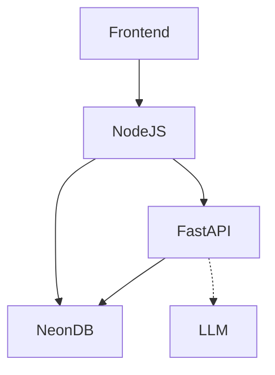

# Razorpay GrowthPilot

A complete, end-to-end AI-powered experimentation platform.

## Architecture & Data Flow

### Components
1. **Node.js (API Gateway)**: Handles JWT authentication, merchant isolation, and standard CRUD operations via Prisma.
2. **FastAPI (AI Engine)**: Handles Python-based data science.
   - **Analytics**: Calculates real metrics.
   - **ML Engine**: Scikit-Learn Uplift Models to identify targetable users.
   - **Experiment Engine**: Deterministic MD5 hashing assignments and rigorous `statsmodels` tests.
   - **Agent/Orchestrator**: Custom State Machine that sequences the workflow.
3. **Neon PostgreSQL**: The single source of truth database.
4. **LLM**: Validated strictly via Pydantic; translates statistics into plain-English.

## Multi-Tenant Data Isolation
Merchant boundaries are enforced at the API Gateway level. The Node.js server extracts `merchantId` from cryptographically signed JWT tokens and injects it securely into the backend AI pipeline. Clients cannot spoof `merchantId`.

## How to run End-To-End Demo
1. Ensure `.env` is populated with `DATABASE_URL` for the Neon database.
2. Start Node.js API: `cd backend && npm run start` or `node src/index.js`
3. Start FastAPI AI Engine: `cd ai-engine && uvicorn main:app`
4. Run `node backend/e2e_demo.js` to see the full autonomous loop!
