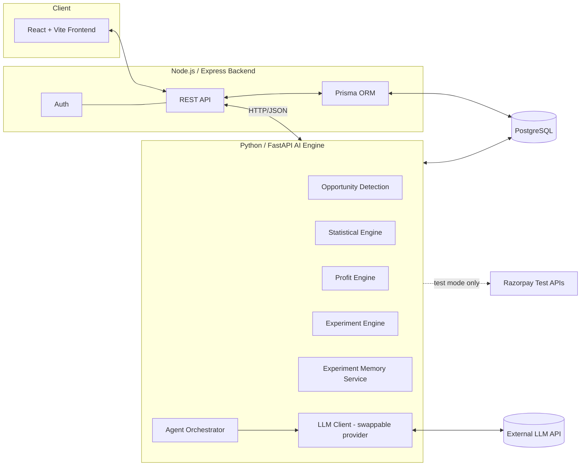
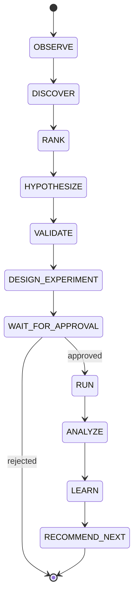
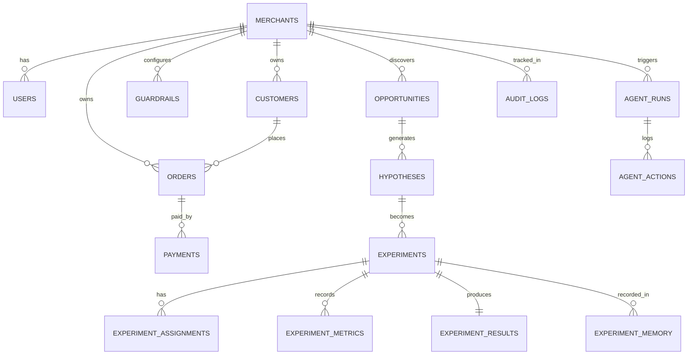

# GrowthPilot — Implementation Plan
### Razorpay AI Buildathon 2026 — Track 1: AI Growth & Agentic Commerce

---

## 1. Executive Summary

GrowthPilot is an AI Growth Scientist for merchants. Instead of waiting for a human to guess what to test, it reads a merchant's payment, order, and customer data, finds patterns that look like real, causally-testable growth opportunities, turns the best one into a hypothesis, designs a controlled A/B experiment around it, asks the merchant to approve it, runs the experiment on the data, measures the *incremental contribution profit* it produced (not just clicks or conversion), and writes the result into a permanent experiment memory that makes its next suggestion smarter.

The product is deliberately narrow: it does one thing — evidence-based, profit-maximizing experimentation — extremely well, rather than being a broad marketing suite. The LLM's job is reasoning, planning, and explanation. It never invents numbers. All statistics come from a deterministic Python/FastAPI analytics engine. This split is the core technical credibility argument of the whole submission.

---

## 2. Problem Definition

**Merchant problem:** Merchants sitting on Razorpay have rich transaction, customer, and payment-method data, but almost none of them run structured experiments. They make growth decisions ("let's give everyone 10% off") based on gut feeling, not evidence.

**Why dashboards aren't enough:** Dashboards show *what happened* (GMV, conversion, AOV) but never *what to do next* or *whether an action actually caused a change*. A dashboard cannot tell a merchant that new customers paying via a specific payment method have unusually low repeat-purchase rates — it just shows numbers side by side.

**Why experimentation is hard for merchants:** Designing a valid control/treatment split, picking a sample size, avoiding contamination, and correctly attributing incremental profit (net of discount and campaign cost) requires statistical literacy most small/mid merchants don't have and don't have time to hire for.

**Why payment intelligence matters:** Payment method, payment failure patterns, and payment timing are underused growth signals that a generic marketing tool never sees, but Razorpay's data stack sees natively. This is GrowthPilot's structural advantage over any competitor that only sees storefront events.

**Exact problem solved:** GrowthPilot converts raw commerce + payment data into a small number of ranked, evidence-backed, profit-quantified experiments, runs them under guardrails, and tells the merchant — in plain language and in rupees — what worked, what didn't, and what to try next.

---

## 3. Product Vision

**What GrowthPilot should become:** A standing "growth scientist" that merchants trust to continuously surface and validate profit-positive changes, the way a data science team would for a large company — except automated, explainable, and always operating inside merchant-defined guardrails.

**What the MVP must demonstrate (and nothing more):**
- Ingest one realistic synthetic merchant dataset.
- Discover 3 real, pre-planted opportunities from that data (not fabricated).
- Turn the top opportunity into a hypothesis + experiment design.
- Get merchant (judge) approval through the UI.
- "Run" the experiment against synthetic outcome data.
- Compute real statistics (lift, confidence, incremental contribution profit) with a real stats engine.
- Explain the result in natural language, grounded in the numbers.
- Store it in experiment memory and recommend what's next.

### MVP
- Single merchant, single dataset, single login (no multi-tenant complexity).
- Opportunity detection: 3–5 rule/statistics-based detectors.
- One end-to-end experiment lifecycle (create → approve → run → analyze → learn).
- LLM used strictly for reasoning/explanation/hypothesis text, never for math.
- Experiment memory that visibly influences the "next recommendation" text.

### Stretch Goals (only if MVP is done early)
- Real Razorpay test-mode payment link creation for the "experiment" arm.
- Multiple concurrent experiments with portfolio-level guardrail budget tracking.
- A second synthetic merchant profile to show generalization.
- Basic sequential/interim-analysis stopping rule.

### Explicitly Out of Scope
- Real production payment data of any kind.
- Multi-tenant auth/roles, billing, or SSO.
- Real-time streaming ingestion.
- LangChain/LangGraph or any heavy agent framework.
- Docker/Kubernetes deployment story.
- Auto-execution of financial actions without human approval.
- General-purpose chat interface unrelated to the growth loop.

**Recruiter-lens self-check (applied while designing this plan):** Is AI genuinely necessary here? Yes — opportunity ranking, hypothesis generation, and natural-language causal explanation are LLM-appropriate; the numbers are not. Could this be mistaken for a generic marketing AI? No, because it never recommends "send a campaign" without a control group and a profit number attached. Is the causal story credible? Yes, because every experiment reports a confidence level and every "opportunity" is explicitly labeled a correlation until tested. This framing is preserved throughout the plan below.

---

## 4. Core User Journey

1. Merchant logs in (single seeded demo account).
2. Lands on **Dashboard** — sees GMV, orders, repeat-rate, and an "AI found 3 opportunities" banner.
3. Opens **Opportunities** — sees 3 cards ranked by expected incremental contribution profit.
4. Opens **Opportunity Detail** — sees the underlying evidence (chart + numbers), the AI's hypothesis in plain English, and a proposed experiment design.
5. Reviews the experiment (control/treatment split, primary metric, budget, guardrail checks) and clicks **Approve**.
6. System "runs" the experiment against the synthetic outcome dataset (instant for demo, but logically time-boxed).
7. **Experiment Detail** page updates with control vs. treatment metrics, lift, confidence interval, incremental revenue, cost, and net incremental contribution profit.
8. GrowthPilot posts a natural-language explanation of the result, grounded in the computed numbers.
9. The result is written to **Experiment Memory**.
10. GrowthPilot immediately proposes the **next** experiment, explicitly referencing what it learned ("Because payment-method-X incentives worked for new customers, I'm now testing whether the same incentive works for lapsed customers").

---

## 5. Feature Breakdown

Each feature: purpose · user interaction · backend · AI · database · success criteria.

### F1. Opportunity Discovery — **P0**
- **Purpose:** Surface ranked, evidence-backed growth opportunities.
- **Interaction:** Dashboard banner → Opportunities list.
- **Backend:** Node endpoint triggers/reads from Python analytics job; caches results.
- **AI:** Python engine computes candidate signals; LLM ranks/narrates only after numbers exist.
- **DB:** `opportunities` table with evidence JSON + expected profit.
- **Success:** At least 3 of the 5 planted synthetic opportunities are surfaced in the top 5 candidates.

### F2. Hypothesis Generation — **P0**
- **Purpose:** Turn a statistical opportunity into a testable, causal hypothesis.
- **Interaction:** Opportunity Detail page shows hypothesis text.
- **Backend:** Node calls FastAPI `/hypothesis/generate` which calls LLM with grounded evidence payload.
- **AI:** LLM writes hypothesis strictly from provided evidence fields (no external facts).
- **DB:** `hypotheses` table linked to `opportunities`.
- **Success:** Hypothesis references at least one real numeric evidence field from the input.

### F3. Experiment Design — **P0**
- **Purpose:** Produce a valid, guardrail-compliant control/treatment experiment spec.
- **Interaction:** Shown on Opportunity Detail before approval.
- **Backend:** FastAPI `/experiment/design` computes split, duration, sample size floor.
- **AI:** LLM proposes design parameters; Python validates/clamps them against rules and guardrails.
- **DB:** `experiments` table (status = `draft`).
- **Success:** No experiment can be created that violates a configured guardrail.

### F4. Merchant Approval — **P0**
- **Purpose:** Human-in-the-loop control before any "spend."
- **Interaction:** Approve / Reject buttons; rejection reason optional.
- **Backend:** Node `PATCH /experiments/:id/approve`.
- **AI:** None — this is a deliberate non-AI checkpoint.
- **DB:** `experiments.status`, `audit_logs`.
- **Success:** No experiment reaches `running` state without an `approved` audit log row.

### F5. Experiment Execution (simulated) — **P0**
- **Purpose:** Assign synthetic customers to control/treatment and generate outcome data.
- **Interaction:** "Run Experiment" button (instant simulate for demo).
- **Backend:** FastAPI `/experiment/run` draws from the synthetic dataset's pre-generated outcome distributions.
- **AI:** None — pure data assignment + simulation.
- **DB:** `experiment_assignments`, `experiment_metrics`.
- **Success:** Deterministic given a fixed random seed; reproducible.

### F6. Statistical Analysis — **P0**
- **Purpose:** Compute lift, confidence interval, significance.
- **Backend:** FastAPI `/experiment/analyze` using `statsmodels`/`scipy` (two-proportion z-test or t-test as appropriate).
- **AI:** None.
- **DB:** `experiment_results`.
- **Success:** Matches hand-calculated values in unit tests to 2 decimal places.

### F7. Profit Engine — **P0**
- **Purpose:** Convert statistical lift into ₹ incremental contribution profit.
- **Backend:** FastAPI `/experiment/profit` — pure formula module (Section 11).
- **AI:** None.
- **DB:** stored on `experiment_results`.
- **Success:** Formula output matches manually verified spreadsheet for 3 test cases.

### F8. Result Explanation — **P0**
- **Purpose:** Explain the result in plain language, grounded in computed numbers.
- **Backend:** FastAPI `/experiment/explain` passes final numbers to LLM with an explicit "do not restate different numbers" instruction; Python validates any numbers in the LLM output against the source numbers before display.
- **AI:** LLM narrates only.
- **DB:** `experiment_results.explanation_text`.
- **Success:** 100% of numeric tokens in the explanation match source data in the validation check.

### F9. Experiment Memory & Next Recommendation — **P0**
- **Purpose:** Make the system visibly learn.
- **Backend:** FastAPI `/memory/update`, `/memory/recommend-next`.
- **AI:** LLM reasons over a compact structured summary of past experiments (not raw data) to propose the next hypothesis.
- **DB:** `experiment_memory`.
- **Success:** The "next recommendation" text explicitly cites a past experiment outcome.

### F10. Guardrails Configuration — **P1**
- **Purpose:** Let the merchant define hard constraints (max discount, max budget, min margin, eligible segments).
- **Interaction:** Settings/Guardrails page.
- **Backend:** Node CRUD; FastAPI reads at design/validation time.
- **DB:** `guardrails` table.
- **Success:** Editing a guardrail immediately affects new experiment validation.

### F11. Agent Activity Timeline — **P1**
- **Purpose:** Visualize the OBSERVE→...→RECOMMEND_NEXT state machine live, for demo impact.
- **Backend:** `agent_runs` / `agent_actions` written at each state transition.
- **DB:** timestamped log rows.
- **Success:** Judges can see the agent "thinking" step by step, not just a final answer.

### F12. Multi-Experiment Portfolio View — **P2**
- **Purpose:** Show several experiments and cumulative learned profit.
- **Success:** Nice-to-have if time remains; not required for MVP demo.

### F13. Razorpay Test-Mode Integration — **P2**
- **Purpose:** Create a real test-mode payment link/offer for the treatment arm to prove real integration capability.
- **Success:** One real API call succeeds in test mode; does not gate the rest of the demo if it fails.

---

## 6. System Architecture



**Communication pattern:** The frontend never talks to the Python engine directly. Node/Express is the single source of truth for auth and is the API gateway; it proxies AI-engine calls over internal HTTP (JSON) to FastAPI, which is the only service allowed to read/write the analytical tables directly (opportunities, experiments, results, memory) alongside Node. Node owns merchant/user/guardrail CRUD. This keeps the trust boundary simple: only FastAPI calls the LLM, and only after assembling grounded, validated evidence payloads.

**Why this split:** Two students can work almost entirely independently — one owns Node+Prisma+React, one owns FastAPI+Pandas+stats+LLM — while sharing one Postgres schema as the contract.

---

## 7. AI Architecture

**What the LLM does:**
- Rank/prioritize already-computed candidate opportunities by narrative significance and merchant fit.
- Generate hypothesis text from a structured evidence payload.
- Propose experiment design *parameters as suggestions* (Python still validates/clamps).
- Generate the plain-language result explanation from final, already-computed numbers.
- Generate the "next recommendation" using a compact summary of experiment memory.

**What the LLM must NOT do:**
- Compute any statistic (p-value, confidence interval, lift, standard error).
- Compute any monetary figure (revenue, cost, profit, ROI).
- Decide random assignment of customers to control/treatment.
- Approve or execute an experiment.
- Access raw customer PII — it only ever sees pre-aggregated, evidence-summary JSON.

**Hallucination prevention / evidence grounding:**
1. Every LLM call receives a structured JSON "evidence block" produced entirely by Python — no free-text summarization by the LLM of numbers it wasn't given.
2. Prompts explicitly instruct: *"Use only the numbers provided below. Do not calculate, estimate, or introduce any number not present in this JSON."*
3. A post-generation **numeric validator** in FastAPI regex-extracts numbers/currency from the LLM's output and checks each against the source evidence JSON (with rounding tolerance). Any unmatched number triggers a regeneration or a fallback template response.
4. All LLM outputs are stored with the exact evidence payload that produced them (`llm_calls` audit trail) for traceability.

**Function/tool calling:** Not required for MVP — the orchestration is a simple Python state machine (Section 8) that calls the LLM client as a plain text-completion step at specific states, then calls deterministic Python functions at all other states. Tool-calling is avoided to reduce failure surface within the two-student timeline.

**LLM provider abstraction:** A single `llm_client.py` module exposes `generate(prompt, evidence) -> text`. Provider (Anthropic/OpenAI/etc.) is chosen via environment variable so the underlying model can be swapped without touching business logic.

---

## 8. Agent Workflow



| State | Input | Output | Validation | Failure handling |
|---|---|---|---|---|
| OBSERVE | Raw merchant tables | Cleaned/aggregated feature set | Row counts > 0, no null primary keys | If dataset empty, halt and surface "insufficient data" |
| DISCOVER | Feature set | Candidate signals (list of correlations) | Minimum sample size per signal | Drop signals below sample-size floor |
| RANK | Candidates | Ranked opportunities w/ expected profit estimate | Expected profit > 0 | Discard non-positive-EV candidates |
| HYPOTHESIZE | Top opportunity + evidence JSON | Hypothesis text | Numeric validator passes | Regenerate once, then fallback template |
| VALIDATE | Hypothesis + guardrails | Feasibility boolean + reasons | Must pass all hard guardrails | Reject infeasible hypothesis, go to next opportunity |
| DESIGN_EXPERIMENT | Hypothesis | Experiment spec (draft) | Guardrail clamp applied | Auto-clamp out-of-range params, log adjustment |
| WAIT_FOR_APPROVAL | Experiment spec | Approved/Rejected | Human action required | No timeout auto-approval, ever |
| RUN | Approved spec + synthetic outcome data | Raw assignment + metric rows | Assignment balance check (~50/50 ± tolerance) | Re-randomize with logged seed if imbalance too large |
| ANALYZE | Raw metrics | Statistical result (lift, CI, p-value) | Test assumptions checked (sample size, variance) | Flag "inconclusive" rather than force a verdict |
| LEARN | Statistical + profit result | Memory entry | Must include outcome label (win/loss/inconclusive) | N/A — always writes, even for a loss |
| RECOMMEND_NEXT | Memory + remaining opportunities | New hypothesis suggestion | References ≥1 past memory entry | Fallback to next-ranked opportunity with generic rationale |

---

## 9. Opportunity Detection Engine

**Signals evaluated (Python, deterministic, on pre-aggregated data):**
- Repeat-purchase rate by payment method
- Checkout abandonment rate by payment method / step
- Payment failure rate by method / bank / segment
- Conversion rate by customer segment (new vs. returning, AOV tier)
- Offer/discount redemption vs. incremental order value
- Refund rate by product/segment
- Order-value distribution shifts over time
- Time-to-second-purchase (customer lifecycle) by cohort

**Correlation-vs-causation discipline:** Every detector output is labeled a *"candidate correlation"* and stored with a `confidence: observational` flag until an experiment produces a `confidence: causal (experimentally validated)` flag. The UI never says "X causes Y" pre-experiment — it says "X is associated with Y; recommended test below."

**Ranking formula (deterministic, Python):**

```
expected_impact_score = estimated_affected_customers
                       × estimated_uplift_per_customer
                       × avg_contribution_margin
                       × evidence_strength_factor (0–1, based on sample size / effect size)
```

Opportunities are sorted descending by `expected_impact_score`; the top N (default 3) are surfaced. `evidence_strength_factor` penalizes small-sample or noisy signals so a flashy-but-unreliable pattern won't outrank a smaller, well-supported one.

---

## 10. Experimentation Engine

- **Assignment:** Simple randomization (hash of `customer_id` + `experiment_id` mod 100) → deterministic, reproducible 50/50 split; stratified by segment if the guardrail requires balance.
- **Duration:** Default suggested duration derived from a minimum-detectable-effect / power calculation (Python, `statsmodels.stats.power`), clamped to a sane demo range (e.g., 7–30 days, compressed for demo simulation).
- **Sample size:** Minimum sample per arm computed for 80% power at 5% significance for the merchant's historical baseline conversion rate; experiments below the floor are flagged `underpowered` rather than blocked outright (with a warning shown to the merchant).
- **Primary metric:** Incremental contribution profit (always). **Secondary metrics:** conversion rate, AOV, repeat-purchase rate.
- **Significance:** Two-proportion z-test (or Welch's t-test for continuous metrics) via `statsmodels`/`scipy.stats`; report p-value and 95% confidence interval on the lift.
- **Stopping rules:** Fixed-horizon by default (no peeking) for MVP simplicity; document sequential testing as future scope (Section 29) rather than implementing it under time pressure.
- **Guardrails at runtime:** Budget cap checked continuously against `incentive_cost_so_far`; auto-flag (not auto-stop, for MVP) if projected total exceeds the approved budget.
- **Preventing false conclusions:** Require the sample-size floor before allowing an `ANALYZE` result to be labeled "significant"; always show the confidence interval, not just a point estimate; label results `inconclusive` rather than falsely `negative` when underpowered.
- **Experiment memory:** Every completed experiment writes hypothesis, design, result, and a short LLM-free structured "learning" (e.g., `{segment: "new_customers", lever: "payment_incentive", outcome: "positive", incremental_profit: 850000}`) that later experiments' ranking step can query.

---

## 11. Economics / Profit Engine

All formulas live in one pure Python module (`profit_engine.py`), unit-tested independently of the LLM.

```
revenue                       = orders × average_order_value
incentive_cost                = treatment_customers_redeemed × discount_per_customer
campaign_cost                 = fixed_campaign_cost (e.g., notification/SMS cost)
contribution_profit            = revenue × contribution_margin_rate − incentive_cost − campaign_cost

incremental_revenue            = (treatment_conversion − control_conversion) × treatment_group_size × average_order_value
incremental_contribution_profit = incremental_revenue × contribution_margin_rate − incentive_cost − campaign_cost

ROI                             = incremental_contribution_profit / (incentive_cost + campaign_cost)
```

**Worked example (matches the target demo):**
```
Control conversion:      8.1%
Treatment conversion:    9.4%
Incremental lift:        +1.3 percentage points
Treatment group size:    100,000 customers → 1,300 incremental converters
Average order value:     ₹850
Incremental revenue:     1,300 × ₹850            = ₹11,05,000 (~₹11.2L incl. rounding basis)
Contribution margin:     35%
Gross incremental margin: ₹11,05,000 × 0.35       = ₹3,86,750
Incentive cost:          ₹2,70,000
Net incremental contribution profit: ₹3,86,750 − ₹2,70,000 ≈ ₹1,16,750
```
*(Note: the numbers in the original target-demo script (₹8.5L net) assume a higher margin/AOV basis — the engine must recompute this live from the actual synthetic dataset's real margin, not hardcode the illustrative figure. The formula module is the single source of truth; illustrative numbers above show the calculation path, not a fixed output.)*

**Cannibalization (where feasible):** Track a matched "adjacent segment" that did *not* receive the treatment to sanity-check whether treatment-arm gains simply pulled purchases forward or from another channel; report as a caveat in the explanation, not a hard blocker, for MVP scope.

---

## 12. Merchant Guardrails

Configurable, stored per-merchant in the `guardrails` table:

| Guardrail | Example default | Enforced at |
|---|---|---|
| Max discount per customer | ₹150 or 10% | DESIGN_EXPERIMENT, RUN |
| Max total experiment budget | ₹3,00,000 | DESIGN_EXPERIMENT, RUN (running total) |
| Minimum contribution margin post-discount | 15% | DESIGN_EXPERIMENT |
| Max concurrent experiments | 2 | DESIGN_EXPERIMENT |
| Max offers per customer per period | 1 per 30 days | RUN (assignment filter) |
| Cooldown between experiments on same segment | 14 days | DESIGN_EXPERIMENT |
| Eligible / excluded segments | e.g., exclude "VIP" segment | DESIGN_EXPERIMENT |
| Prohibited actions | e.g., no price changes, no > 20% discount ever | VALIDATE (hard block) |

**Enforcement point:** A single `guardrail_validator.py` function is called at `VALIDATE` and again at `DESIGN_EXPERIMENT`/`RUN` (defense in depth) — it either returns `ok: true` or a list of violated rules with human-readable reasons, which the UI surfaces before approval is even possible. No experiment can transition to `running` if the validator has not returned `ok: true` and logged an audit row.

---

## 13. Database Design



| Table | Purpose | Key columns | Notes |
|---|---|---|---|
| `merchants` | Tenant root | id, name, contribution_margin_rate | one row for MVP demo |
| `users` | Login | id, merchant_id, email, password_hash, role | single seeded user |
| `customers` | Synthetic customer records | id, merchant_id, segment, created_at | indexed on merchant_id, segment |
| `orders` | Synthetic orders | id, customer_id, amount, created_at, status | indexed on customer_id, created_at |
| `payments` | Payment attempts | id, order_id, method, status, failure_reason | indexed on method, status |
| `offers` | Discounts/incentives applied | id, order_id, discount_amount, offer_type | |
| `opportunities` | Discovered candidate signals | id, merchant_id, type, evidence_json, expected_impact_score, status | evidence_json is the grounding payload for the LLM |
| `hypotheses` | Generated hypotheses | id, opportunity_id, text, evidence_json | |
| `experiments` | Experiment lifecycle | id, hypothesis_id, status, design_json, guardrail_check_json, approved_at | status enum: draft/approved/running/analyzed/rejected |
| `experiment_assignments` | Control/treatment mapping | id, experiment_id, customer_id, arm | indexed on experiment_id |
| `experiment_metrics` | Raw per-arm outcome counts | id, experiment_id, arm, metric_name, value | |
| `experiment_results` | Final computed stats + profit | id, experiment_id, lift, p_value, confidence_interval, incremental_revenue, incremental_profit, explanation_text | |
| `experiment_memory` | Structured learnings | id, experiment_id, segment, lever, outcome_label, incremental_profit, created_at | queried by RECOMMEND_NEXT |
| `guardrails` | Merchant constraints | id, merchant_id, rule_type, value_json | |
| `agent_runs` | One row per agent loop execution | id, merchant_id, started_at, ended_at, final_state | |
| `agent_actions` | One row per state transition | id, agent_run_id, state, input_json, output_json, timestamp | powers Agent Activity Timeline UI |
| `audit_logs` | Every approval/rejection/guardrail block | id, merchant_id, actor, action, entity, entity_id, created_at | |

Only tables genuinely needed for the MVP loop are included; `customer_segments` is folded into `customers.segment` rather than a separate table to avoid unneeded joins at this scale.

---

## 14. API Design

**Node/Express — merchant-facing REST API** (all routes except `/auth/*` require a session token):

| Endpoint | Method | Purpose |
|---|---|---|
| `/auth/login` | POST | Merchant/user login |
| `/dashboard/summary` | GET | High-level KPIs for dashboard |
| `/opportunities` | GET | List ranked opportunities |
| `/opportunities/:id` | GET | Opportunity detail + evidence + hypothesis |
| `/experiments` | GET | List experiments (all statuses) |
| `/experiments/:id` | GET | Experiment detail |
| `/experiments` | POST | Create draft experiment (proxies to FastAPI design) |
| `/experiments/:id/approve` | PATCH | Merchant approval → triggers RUN |
| `/experiments/:id/reject` | PATCH | Merchant rejection |
| `/experiments/:id/results` | GET | Final stats + profit + explanation |
| `/memory` | GET | Experiment memory / learning history |
| `/guardrails` | GET/PUT | View/update merchant guardrails |
| `/agent/activity` | GET | Agent run/action timeline |

**Node → FastAPI internal calls** (server-to-server, not exposed to frontend):

| Endpoint | Method | Purpose |
|---|---|---|
| `/internal/agent/run-cycle` | POST | Executes OBSERVE → RECOMMEND_NEXT (or resumes at a given state) |
| `/internal/opportunity/discover` | POST | Runs detectors on merchant data |
| `/internal/hypothesis/generate` | POST | LLM hypothesis generation |
| `/internal/experiment/design` | POST | Design + guardrail validation |
| `/internal/experiment/run` | POST | Simulated execution |
| `/internal/experiment/analyze` | POST | Stats + profit computation |
| `/internal/experiment/explain` | POST | LLM explanation + numeric validation |
| `/internal/memory/recommend-next` | POST | Next hypothesis suggestion |

---

## 15. Python AI Engine

| Module | Responsibility | Interface |
|---|---|---|
| `data_loader.py` | Load/aggregate merchant data from Postgres into pandas frames | `load_merchant_features(merchant_id)` |
| `opportunity_detection.py` | Run all signal detectors | `detect(features) -> list[Candidate]` |
| `ranking.py` | Score and rank candidates | `rank(candidates) -> list[Opportunity]` |
| `hypothesis.py` | Build evidence JSON + call LLM | `generate_hypothesis(opportunity) -> Hypothesis` |
| `guardrail_validator.py` | Validate/clamp experiment design | `validate(design, guardrails) -> ValidationResult` |
| `experiment_design.py` | Compute split/duration/sample size | `design(hypothesis) -> ExperimentSpec` |
| `experiment_runner.py` | Simulate assignment + outcomes | `run(experiment) -> RawMetrics` |
| `stats_engine.py` | Significance/CI/lift | `analyze(raw_metrics) -> StatResult` |
| `profit_engine.py` | ₹ calculations (Section 11) | `compute_profit(stat_result, experiment) -> ProfitResult` |
| `explanation.py` | LLM explanation + numeric validator | `explain(stat_result, profit_result) -> str` |
| `memory.py` | Write/query experiment memory, next recommendation | `record(result)`, `recommend_next(merchant_id)` |
| `llm_client.py` | Provider-agnostic LLM wrapper | `generate(prompt, evidence) -> str` |
| `agent.py` | State machine orchestrator, logs to `agent_runs`/`agent_actions` | `run_cycle(merchant_id, resume_state=None)` |

---

## 16. Synthetic Data Strategy

A single Python generator script (`generate_synthetic_data.py`, seeded for reproducibility) produces: ~5,000–20,000 customers, ~15,000–50,000 orders, payments across 4–5 methods (UPI, cards, netbanking, wallet, EMI), offers, refunds, and 6–12 months of timestamps, plus 2–3 pre-completed "historical" experiments to seed initial memory.

**Five planted, hidden ground-truth opportunities** (used to score F1's success criterion):
1. **New customers via Payment Method A have a 30–40% lower second-purchase rate** than those via Method B — true lever: post-purchase payment-method-targeted incentive.
2. **Checkout abandonment spikes for orders above ₹2,000 paid via netbanking** due to a simulated redirect-failure pattern — true lever: alternate payment nudge above that order value.
3. **A specific customer segment ("weekend browsers") has high AOV but low conversion** — true lever: timing-based nudge/offer.
4. **Refund rate is elevated for a specific product category / segment combination**, silently eroding contribution margin — true lever: a segment-specific policy or bundling change (used as a "profit-negative, do NOT test with a discount" trap case to prove the system doesn't blindly recommend discounts).
5. **Lapsed customers (no purchase in 90+ days) respond well to a smaller incentive than active customers** — true lever: differentiated incentive sizing by lifecycle stage.

Each planted opportunity has a documented **ground truth**: expected direction, approximate true effect size, and expected profit sign, stored in `docs/synthetic_ground_truth.md` (not read by the app) so the team can score detection accuracy during evaluation (Section 17). Randomness in the generator is bounded (effect sizes have realistic noise) so the detectors have to actually work rather than reading a suspiciously clean signal.

---

## 17. Evaluation Framework

| Metric | Definition | Target for demo |
|---|---|---|
| Opportunity precision | Fraction of surfaced top-5 opportunities matching a planted ground-truth pattern | ≥ 60% (3/5) |
| Hypothesis quality | Manual rubric: cites evidence, states a testable claim, avoids overreach | Pass on all 3 shown hypotheses |
| Experiment validity | Sample size ≥ floor, correct test used for metric type | 100% of run experiments |
| Statistical correctness | Engine output matches independent manual calculation | Exact match in unit tests |
| Profit estimation error | \|engine profit − ground-truth profit\| / ground-truth profit | < 15% |
| False-positive rate | Opportunities surfaced with no real underlying pattern | As low as feasible; document any known false positives |
| Recommendation quality (next-experiment) | Manual rubric: references memory, logically follows from result | Pass on demo path |
| Explanation groundedness | % of numbers in LLM explanation matching source data | 100% (enforced by validator, not just measured) |
| Time saved for merchant (narrative) | Qualitative story point for the pitch, not a live metric | Include in Demo Story only |

---

## 18. Security and Reliability

- **Secrets:** All API keys (LLM, Razorpay) in `.env`, never committed; `.env.example` documents required vars with placeholder values only.
- **Auth:** Single-merchant session-based auth (JWT or signed cookie) is sufficient for MVP; passwords hashed with bcrypt.
- **Authorization:** Every Node route checks the session belongs to the merchant owning the requested entity.
- **Input validation:** All Node routes validate request bodies (e.g., with `zod`-free manual checks or a lightweight validator) before hitting Prisma or FastAPI.
- **SQL injection:** Prisma parameterizes all queries by default; FastAPI uses SQLAlchemy/parameterized queries, never raw string interpolation.
- **Prompt injection:** LLM prompts clearly separate system instructions from data; evidence JSON is never treated as instructions; the numeric validator additionally catches attempts to smuggle fabricated numbers through free-text evidence fields.
- **LLM output validation:** As described in Section 7 — regenerate-then-fallback-template on any unvalidated number; explanation and hypothesis text are never inserted into the DB or shown to the user unvalidated.
- **Rate limiting:** Basic per-IP rate limit on Node auth and experiment-approval endpoints to prevent abuse during the live demo/judging period.
- **Audit logs:** Every approval, rejection, and guardrail block is written to `audit_logs` with actor and timestamp.
- **Sensitive payment data:** Only synthetic data is used; even in the Razorpay test-mode stretch goal, no real card/bank data ever touches the system.
- **Failure recovery:** Each FastAPI internal endpoint returns a typed error; Node catches and surfaces a specific, human-readable message rather than crashing; the agent orchestrator can resume from the last successfully logged state in `agent_actions` rather than restarting from OBSERVE.

---

## 19. Razorpay Integration Strategy

- **Where it fits:** Payment-method-level signals (F1's core differentiator) are modeled on the shape of real Razorpay payment data (method, status, failure_reason, timestamps) even though the MVP dataset is synthetic — this is the "payment intelligence" story.
- **What's realistic for a student build:** Using Razorpay's **test/sandbox mode** to create a real payment link or test order representing the treatment-arm incentive, strictly to prove integration competence — not to process real money.
- **What should be mocked/simulated:** All actual "experiment outcomes" (who converted, who didn't) — real payment collection at demo scale isn't feasible or necessary; the synthetic outcome generator (Section 16) drives ANALYZE.
- **What must never happen:** Real customer PII or real payment credentials in the repo, logs, or demo; no undocumented or invented Razorpay endpoints — only documented test-mode APIs (e.g., Orders API, Payment Links API in test mode) are referenced, and only if time allows after the MVP loop is solid.

---

## 20. Frontend Pages

| Page | Purpose | Key UI components |
|---|---|---|
| Login | Auth entry point | Email/password form, error state |
| Dashboard | Orientation + KPI snapshot | KPI cards, "AI found N opportunities" banner, recent activity feed |
| Opportunities | Ranked list of discovered opportunities | Opportunity cards (expected profit, confidence badge), sort/filter |
| Opportunity Detail | Evidence, hypothesis, proposed experiment | Evidence chart (Recharts), hypothesis text block, experiment design summary, Approve/Reject buttons, guardrail check panel |
| Experiment Creation (embedded in Opportunity Detail for MVP) | Review/adjust experiment params before approval | Split slider (locked to guardrail bounds), budget display, primary metric label |
| Experiment Detail | Live/final results | Control vs. treatment metric comparison, lift + CI chart, profit breakdown table, explanation text block |
| AI Agent Activity | Show the state machine executing | Timeline/stepper component synced to `agent_actions`, live state highlight |
| Experiment History / Memory | Past experiments and cumulative learning | Table of past experiments, outcome labels, cumulative incremental profit counter |
| Settings / Guardrails | Configure constraints | Form inputs per guardrail type, save confirmation |

---

## 21. Demo Story (3–4 minutes)

1. **(20s) Problem:** "Merchants have all this payment and order data, but no one is running real experiments on it — decisions are guesses."
2. **(30s) Discovery:** Open Dashboard → Opportunities. "GrowthPilot already found 3 opportunities, ranked by expected profit, not vanity metrics."
3. **(40s) Evidence + Hypothesis:** Open Opportunity #1. Show the evidence chart, read the hypothesis aloud — emphasize it's grounded in real payment-method data.
4. **(30s) Experiment Design + Approval:** Show the guardrail-checked experiment design, click Approve — "nothing runs without a human in the loop."
5. **(45s) Result:** Jump to Experiment Detail with control vs. treatment numbers, lift, confidence, and the full profit breakdown (revenue → cost → net incremental profit) — read the AI's grounded explanation.
6. **(30s) Learning:** Show Experiment Memory updating and the very next recommendation explicitly referencing this result.
7. **(15s) Close:** "GrowthPilot doesn't just analyze what happened — it decides what's worth testing, proves whether it worked, and learns what to do next. And because it's built on payment intelligence, it sees things a storefront-only tool never could."

---

## 22. Development Phases

| Phase | Tasks | Dependencies | Output | Definition of Done |
|---|---|---|---|---|
| 0. Architecture/Setup | Repo scaffold, `.env.example`, Postgres + Prisma init, FastAPI skeleton, CI-less local run scripts | None | Both services boot locally | `npm run dev` and `uvicorn` both start clean |
| 1. Database/Backend | Full Prisma schema, Node CRUD for merchants/guardrails, auth | Phase 0 | Working REST API against empty DB | Postman/curl round-trip for every core route |
| 2. Synthetic Data | Data generator script, seed DB, ground-truth doc | Phase 1 | Populated realistic dataset | 5 planted patterns verifiably present via a scratch analysis notebook |
| 3. Analytics Engine | `data_loader`, `opportunity_detection`, `ranking`, `stats_engine`, `profit_engine` | Phase 2 | Deterministic opportunity + stats output | Unit tests pass; detects ≥3/5 planted patterns |
| 4. Experiment Engine | `experiment_design`, `guardrail_validator`, `experiment_runner` | Phase 3 | Full non-AI experiment lifecycle works via API | Experiment can go draft→approved→run→analyzed without any LLM call |
| 5. AI Agent | `hypothesis.py`, `explanation.py`, `memory.py`, `agent.py` state machine, numeric validator | Phase 4 | Full OBSERVE→RECOMMEND_NEXT cycle | One complete agent run produces a valid, grounded explanation and next recommendation |
| 6. Frontend | All pages (Section 20), wired to real API | Phase 1 (can start early on mocked data) | Clickable full app | Full user journey (Section 4) works end-to-end in browser |
| 7. Integration | Wire Node↔FastAPI internal endpoints, error handling, audit logs | Phases 5 & 6 | Fully integrated system | Demo path works with zero manual DB edits |
| 8. Testing | Unit (stats/profit), integration (API), a few frontend smoke tests | Phase 7 | Test suite | Core formulas and experiment lifecycle covered |
| 9. Demo Polish | Seed a clean demo dataset, rehearse timing, screenshots, README, architecture diagram export | Phase 8 | Submission-ready package | Section 28 checklist fully satisfied |

---

## 23. Two-Person Work Distribution

**Person A** (leans backend/data): Postgres schema + Prisma, Node auth/CRUD/guardrails routes, synthetic data generator, `stats_engine.py`, `profit_engine.py`, unit tests for both.

**Person B** (leans AI/frontend): FastAPI skeleton + internal routes, `opportunity_detection.py`, `hypothesis.py`, `explanation.py`, `memory.py`, `agent.py` state machine, React frontend for all pages.

**Shared responsibilities:** API contract definition (Section 14) written together before either side codes against it; `experiment_design.py` and `guardrail_validator.py` (touches both stats and business rules) paired on; demo rehearsal and README.

**Integration points:** Daily 15-minute sync on the shared Prisma/SQLAlchemy schema (single source of truth, changes announced before migrating); Node↔FastAPI internal API contract frozen after Phase 0; both people run the full agent cycle locally at least once before Phase 7 to catch mismatches early.

Both people must be able to explain, unassisted, why a given experiment result is profit-positive or negative and what the LLM did vs. didn't compute — this is explicitly rehearsed, not just divided.

---

## 24. Git/GitHub Workflow

- **Branches:** `main` (always demoable) ← `dev` ← short-lived `feature/*` branches per task from Section 22's phase table.
- **Commits:** Conventional style — `feat:`, `fix:`, `chore:`, `docs:`, `test:` prefixes; imperative mood, one logical change per commit.
- **Pull requests:** Every feature branch → `dev` via PR, even solo; PR description references the Phase/Feature ID (e.g., "F3 — Experiment Design"); at least a self-review checklist before merge given the two-person team.
- **Code review:** The other person reviews any PR touching the shared schema or the internal API contract before merge; other PRs can self-merge if time-constrained but should still be opened for visibility.
- **Issues:** One GitHub Issue per feature (F1–F13) and per Phase task; labeled `P0`/`P1`/`P2` matching Section 5.
- **Milestones:** One GitHub Milestone per Development Phase (Section 22).
- **README expectations:** Setup instructions (env vars, DB seed, run commands for both services), architecture diagram image, demo script summary, and a "what's mocked vs. real" transparency section.

---

## 25. Testing Strategy

- **Unit tests (Python):** `stats_engine.py` and `profit_engine.py` against hand-calculated fixtures; `guardrail_validator.py` against pass/fail rule combinations.
- **API tests (Node):** Every route in Section 14's merchant-facing table, happy path + one auth-failure path each.
- **Statistical tests:** Verify significance test selection (proportion vs. continuous) picks the correct test given metric type; verify confidence interval math independently (e.g., against `scipy` reference values).
- **AI workflow tests:** Mock the LLM client in tests and assert the numeric validator correctly rejects an injected fabricated number.
- **Integration tests:** Full agent cycle run against the seeded synthetic dataset, asserting the pipeline reaches `RECOMMEND_NEXT` without error.
- **Frontend tests:** Smoke test that each page in Section 20 renders without crashing given seeded API responses; one full Cypress/Playwright-style happy-path click-through if time allows (optional, P2).
- **Experiment correctness:** A known-answer synthetic experiment (fixed seed, hand-computed expected lift/profit) asserted against engine output in CI-less local test run.
- **Edge cases:** Zero-conversion arm, guardrail-violating design, underpowered sample, LLM output containing an unvalidated number (must be caught, not shown).

---

## 26. Failure Scenarios

| Scenario | Detection | Response | Fallback |
|---|---|---|---|
| Insufficient sample size | Pre-check in `experiment_design.py` against power calc | Flag `underpowered`, show warning | Allow merchant to proceed with explicit acknowledgement, or suggest larger segment |
| Contradictory data | Detector confidence score very low / conflicting signals | Suppress from top-ranked list | Log as low-confidence candidate, not surfaced |
| No statistically significant result | p-value above threshold | Label `inconclusive`, not `failed` | Still write to memory; recommend a follow-up test or a different segment |
| AI-generated invalid hypothesis | Numeric validator fails twice | Discard LLM output | Use a deterministic fallback template built from evidence JSON fields |
| Impossible experiment (violates hard guardrail) | `guardrail_validator.py` hard block | Block at VALIDATE, show reasons | Offer next-ranked opportunity instead |
| Budget constraint violation mid-run | Running-cost check during RUN | Flag over-budget | Cap further assignment; analyze on data collected so far |
| LLM API failure/timeout | Try/except around `llm_client.generate` | Retry once with backoff | Deterministic fallback template text, clearly labeled as such |
| Python (FastAPI) service unavailable | Node request timeout/connection error | Node returns explicit 503 with message | UI shows "AI engine unavailable" state, not a silent crash |
| Database failure | Prisma/SQLAlchemy connection error | Log + typed error response | Health-check endpoint used pre-demo to catch this early |
| Duplicate experiment (same hypothesis re-run) | Uniqueness check on `(hypothesis_id, status != rejected)` | Block creation | Point to the existing experiment instead |
| Experiment contamination (customer in two active experiments) | Check `experiment_assignments` before assignment | Exclude already-assigned customers | Log exclusion count in `agent_actions` for transparency |

---

## 27. MVP Cut Line

**Must be completed for a valid submission:**
- Working end-to-end journey from Section 4, on real (synthetic) data, with real Postgres-backed persistence.
- Real statistical computation (not hardcoded numbers) for at least one full experiment.
- Real profit-engine computation matching the formulas in Section 11.
- At least one LLM-generated hypothesis and one LLM-generated explanation, both passing the numeric validator.
- Experiment memory that visibly changes the next recommendation.
- Guardrails enforced (at least the hard-block type) before approval.
- A clean README and architecture diagram.

**Do NOT build, even if it sounds cool:** multi-tenant support, real payment processing, sequential/interim statistical testing, LangChain-style multi-agent frameworks, Docker/K8s deployment, a general chatbot interface, TypeScript migration, or a second full dataset — all are explicitly deferred to Section 29.

---

## 28. Final Submission Checklist

- [ ] Working application (frontend + backend + AI engine) runnable from a clean clone via README instructions
- [ ] GitHub repository, public or shared with judges, matching the structure in the prompt
- [ ] README with setup, architecture overview, and "what's real vs. simulated" section
- [ ] Architecture diagram (exported from the Mermaid in Section 6)
- [ ] Seeded demo dataset with the 5 planted opportunities intact
- [ ] Screenshots of Dashboard, Opportunity Detail, Experiment Detail, Agent Activity
- [ ] Demo video (3–4 min, following Section 21 script)
- [ ] Pitch deck / presentation summarizing problem, differentiation, and demo
- [ ] `docs/synthetic_ground_truth.md` documenting the planted opportunities
- [ ] Security check: no secrets committed, `.env.example` present and accurate
- [ ] Environment setup verified on a fresh machine/branch by the teammate who didn't write it
- [ ] Test suite present and passing (Section 25)

---

## 29. Future Scope

- Sequential/interim analysis with proper alpha-spending to allow early stopping.
- Real Razorpay production-adjacent integration (with merchant consent flows) for live incentive delivery.
- Multi-tenant merchant onboarding with self-serve guardrail setup.
- Bandit-style adaptive experiment allocation once a portfolio of experiments exists.
- Richer cannibalization/causal-inference methods (e.g., synthetic control, diff-in-diff) for cases without clean A/B splits.
- Cross-merchant benchmark learning (anonymized) to warm-start opportunity ranking for new merchants.

---

## 30. Final Build Order

1. Scaffold repo structure and both services (Phase 0).
2. Define and freeze the Postgres schema + Node↔FastAPI API contract together.
3. Build Node auth, guardrail CRUD, and core CRUD routes against the schema.
4. Write and run the synthetic data generator; verify the 5 planted patterns exist via a scratch analysis.
5. Build `stats_engine.py` and `profit_engine.py`; unit-test both against hand-calculated fixtures.
6. Build `opportunity_detection.py` and `ranking.py`; confirm ≥3/5 planted opportunities surface.
7. Build `experiment_design.py` and `guardrail_validator.py`; confirm no guardrail-violating experiment can be created.
8. Build `experiment_runner.py`; confirm deterministic, reproducible control/treatment simulation.
9. Wire the full non-AI experiment lifecycle end-to-end via API calls (no LLM yet) and test it.
10. Integrate the LLM client; build `hypothesis.py` and `explanation.py` with the numeric validator.
11. Build `memory.py` and `agent.py`; run one full OBSERVE→RECOMMEND_NEXT cycle successfully.
12. Build the React frontend pages against the now-stable API, starting with Dashboard → Opportunities → Opportunity Detail.
13. Build Experiment Detail, Agent Activity, and Experiment History pages.
14. Build Settings/Guardrails page and wire it live to the validator.
15. Full integration pass: run the entire Section 4 journey in the browser with zero manual DB edits.
16. Write tests across Sections 25/26 failure scenarios.
17. Seed the final clean demo dataset and rehearse the Section 21 demo script end-to-end at least three times.
18. Finalize README, architecture diagram export, screenshots, and pitch deck.
19. Run the Section 28 checklist top to bottom before submission.